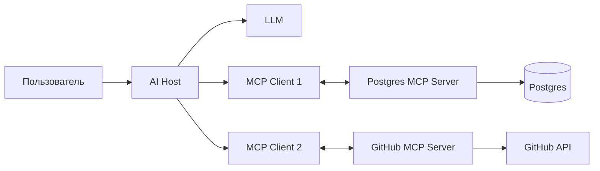
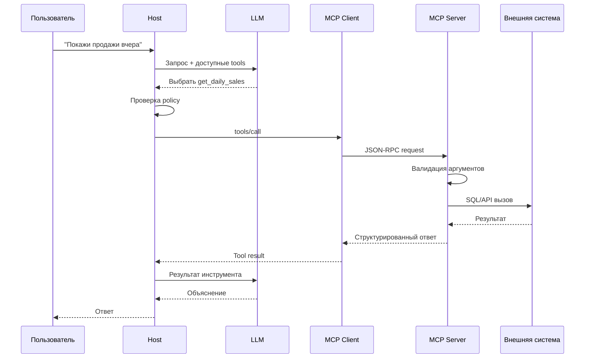
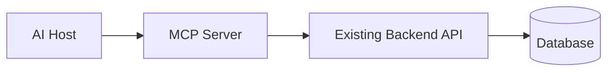

# Model Context Protocol с нуля
## Бизнесовый и технический контекст для будущего DS / ML Engineer / AI Engineer

---

# 1. Зачем вообще появился MCP

Большая языковая модель преобразует входной текст в выходной текст. В упрощённом виде:

```text
текст пользователя → токены → нейросеть → вероятности следующих токенов → ответ
```

Это мощный механизм, но сама модель:

- не знает текущий остаток товара в конкретном магазине;
- не видит внутреннюю базу компании;
- не может гарантированно узнать, прошёл ли банковский платёж;
- не умеет физически создать задачу в Jira;
- не может самостоятельно отправить письмо;
- не знает актуальный курс без внешнего источника;
- не должна иметь прямой неограниченный доступ к production-базе;
- не может доказать, что число взято из source of truth, а не сгенерировано.

Чтобы AI-система приносила бизнес-ценность, ей нужно безопасно взаимодействовать с внешним миром:

- базами данных;
- API;
- файловыми системами;
- CRM и ERP;
- GitHub, Slack и Google Drive;
- системами мониторинга;
- платёжными шлюзами;
- ML-моделями;
- браузером;
- внутренними сервисами.

До общего протокола каждую интеграцию часто приходилось писать отдельно:

```text
AI-приложение A → специальный клиент GitHub
AI-приложение A → специальный клиент Postgres
AI-приложение A → специальный клиент Slack

AI-приложение B → ещё один клиент GitHub
AI-приложение B → ещё один клиент Postgres
AI-приложение B → ещё один клиент Slack
```

Возникает проблема `M × N`:

- `M` AI-приложений;
- `N` внешних систем;
- потенциально `M × N` уникальных интеграций.

MCP превращает это в более управляемую модель:

```text
AI-приложения поддерживают MCP
Внешние системы предоставляют MCP-серверы
```

Обе стороны реализуют общий протокол, а не договариваются уникально для каждой пары.

---

# 2. Аналогия с USB-C

В официальной документации MCP сравнивают с USB-C для AI-приложений.

До универсального разъёма каждое устройство требовало собственный кабель. После стандартизации производитель ноутбука и производитель периферии реализуют общий интерфейс.

Аналогично:

- AI-host знает, как быть MCP-клиентом;
- интеграция знает, как быть MCP-сервером;
- стороны обнаруживают возможности;
- обмениваются стандартизированными сообщениями;
- согласуют поддерживаемые функции.

Но MCP — не просто «провод». Он определяет:

- роли участников;
- формат сообщений;
- инициализацию;
- capability negotiation;
- обнаружение инструментов;
- вызовы инструментов;
- передачу ресурсов;
- шаблоны prompt;
- уведомления;
- обработку ошибок;
- transports;
- часть требований к авторизации.

---

# 3. UI, API, OpenAPI, tool calling и MCP

## 3.1. UI

UI предназначен для человека.

В CRM менеджер нажимает:

```text
Клиенты → Найти клиента → Открыть карточку → Создать задачу
```

Человек видит кнопку, форму, меню, таблицу и уведомление. Внутренняя сложность скрыта.

## 3.2. API

API предназначен для программ.

```http
POST /customers/42/tasks
Content-Type: application/json

{
  "title": "Позвонить клиенту",
  "due_date": "2026-07-15"
}
```

API — контракт:

- какой endpoint вызвать;
- каким методом;
- какие параметры передать;
- какие заголовки нужны;
- какой ответ вернётся;
- какие ошибки возможны.

## 3.3. OpenAPI

OpenAPI формально описывает HTTP API:

- paths;
- methods;
- parameters;
- request body;
- response schemas;
- status codes;
- security schemes.

Он используется для документации, генерации клиентов, Swagger UI, тестирования и валидации.

## 3.4. Function calling / tool calling

Tool calling — способность LLM выбрать функцию и сформировать аргументы.

```json
{
  "name": "get_weather",
  "description": "Получить погоду в городе",
  "parameters": {
    "type": "object",
    "properties": {
      "city": {"type": "string"}
    },
    "required": ["city"]
  }
}
```

Пользователь спрашивает:

```text
Какая погода в Ташкенте?
```

Модель решает:

```text
Нужно вызвать get_weather(city="Ташкент")
```

Критически важно: модель не выполняет функцию физически. Она формирует намерение. Runtime приложения проверяет вызов, выполняет код и возвращает результат модели.

## 3.5. MCP

MCP стандартизирует не одну функцию, а протокольную модель:

- host;
- client;
- server;
- initialization;
- capabilities;
- tools;
- resources;
- prompts;
- client features;
- notifications;
- transports;
- ошибки и lifecycle.

Удобная формула:

```text
Tool calling = как модель выбирает действие.
MCP = как AI-приложение обнаруживает и вызывает внешние возможности.
API = как конкретная система предоставляет операции.
OpenAPI = как документируется HTTP API.
```

---

# 4. Главное исправление к упрощённому описанию урока

Иногда MCP объясняют так:

> Сервис публикует JSON/YAML-спецификацию, агент её читает и автоматически вызывает REST endpoints.

Это ближе к OpenAPI.

Технически MCP — это:

- открытый протокол;
- использующий JSON-RPC 2.0;
- с жизненным циклом соединения;
- с согласованием возможностей;
- с сущностями `tools`, `resources`, `prompts`;
- с двусторонними requests и notifications;
- с несколькими transports.

MCP-сервер может быть обёрткой над REST API, но MCP не сводится к REST-спецификации.

---

# 5. Три ключевые роли: Host, Client, Server

## 5.1. Host

Host — приложение, с которым взаимодействует пользователь.

Примеры:

- desktop AI assistant;
- IDE с AI-агентом;
- корпоративный чат;
- аналитический copilot;
- агент поддержки;
- внутренний agent workflow.

Host отвечает за общую оркестрацию:

- пользовательский интерфейс;
- вызов LLM;
- создание MCP-клиентов;
- подключение к нескольким серверам;
- агрегацию контекста;
- пользовательские подтверждения;
- политики безопасности;
- разрешения;
- аудит.

```text
Host = главный управляющий центр AI-приложения.
```

## 5.2. Client

MCP client — протокольный компонент внутри host.

Обычно один client поддерживает одно соединение с одним server.

```text
Host
├── MCP Client A → GitHub MCP Server
├── MCP Client B → Postgres MCP Server
└── MCP Client C → Slack MCP Server
```

Client отвечает за:

- установление соединения;
- `initialize`;
- согласование версии;
- обмен capabilities;
- отправку запросов;
- получение ответов;
- notifications;
- протокольные ошибки;
- управление session.

```text
Client = переводчик и канал связи между host и одним MCP-сервером.
```

## 5.3. Server

MCP server — программа, предоставляющая AI-приложению возможности:

- tools;
- resources;
- prompts.

Примеры:

- файловая система;
- GitHub;
- Postgres;
- аналитическая платформа;
- CRM;
- база знаний;
- сервис прогноза спроса;
- рекламная платформа.

Server не обязан содержать LLM. Обычно это адаптер:

```text
MCP-запрос
    ↓
валидация
    ↓
бизнес-правила
    ↓
API / база / ML-модель
    ↓
структурированный результат
    ↓
MCP-ответ
```

---

# 6. Архитектура в схемах





---

# 7. JSON-RPC 2.0 простыми словами

MCP использует JSON-RPC 2.0.

## Request

```json
{
  "jsonrpc": "2.0",
  "id": 17,
  "method": "tools/list",
  "params": {}
}
```

- `jsonrpc` — версия;
- `id` — идентификатор запроса;
- `method` — метод;
- `params` — параметры.

## Response

```json
{
  "jsonrpc": "2.0",
  "id": 17,
  "result": {
    "tools": []
  }
}
```

## Error

```json
{
  "jsonrpc": "2.0",
  "id": 17,
  "error": {
    "code": -32602,
    "message": "Invalid params"
  }
}
```

## Notification

```json
{
  "jsonrpc": "2.0",
  "method": "notifications/tools/list_changed"
}
```

Notification не имеет `id`, потому что ответ не ожидается.

---

# 8. Жизненный цикл соединения

MCP не начинает работу сразу с `tools/call`.

```text
1. Client открывает transport.
2. Client отправляет initialize.
3. Server отвечает версией, capabilities и server info.
4. Client отправляет initialized notification.
5. Начинается нормальная работа.
6. Client запрашивает tools/resources/prompts.
7. Client вызывает возможности.
8. Соединение корректно закрывается.
```

## Почему initialize важен

Компоненты могут обновляться независимо. Client может поддерживать новую функцию, server — старую версию. Capability negotiation отвечает на вопросы:

```text
Что умеет client?
Что умеет server?
Какую версию используем?
Какие дополнительные функции доступны?
```

Это базовый принцип распределённых систем: нельзя предполагать, что все компоненты обновлены одновременно.

---

# 9. Server features

## 9.1. Tools

Tool — действие, которое модель может выбрать и вызвать.

Примеры:

- выполнить безопасный аналитический запрос;
- создать issue;
- отправить уведомление;
- пересчитать прогноз;
- найти клиента;
- оформить возврат;
- получить курс;
- запустить ML inference.

У tool есть имя, описание, input schema, иногда output schema и результат.

```json
{
  "name": "get_store_forecast",
  "description": "Возвращает прогноз спроса по магазину и товару",
  "inputSchema": {
    "type": "object",
    "properties": {
      "store_id": {"type": "integer"},
      "sku_id": {"type": "integer"},
      "date_from": {"type": "string", "format": "date"},
      "date_to": {"type": "string", "format": "date"}
    },
    "required": ["store_id", "sku_id", "date_from", "date_to"]
  }
}
```

Плохой tool:

```text
run_query — выполняет запрос
```

Хороший tool:

```text
get_store_sales — возвращает агрегированные продажи магазина
за период не более 90 дней. Read-only. Не изменяет данные.
```

Опасный интерфейс:

```text
execute_any_sql(sql: string)
```

Более безопасный:

```text
get_sales_summary(store_ids, date_from, date_to, group_by)
```

Второй легче валидировать, тестировать, логировать и защищать.

## 9.2. Resources

Resource — данные или контекст:

- файл;
- схема базы;
- документация;
- карточка клиента;
- справочник метрик;
- конфигурация;
- отчёт;
- лог.

Resource обычно имеет URI:

```text
file:///workspace/README.md
postgres://analytics/schema/orders
company://metrics/forecast_accuracy
crm://customer/12345
```

Разница:

```text
Resource: "Дай описание WAPE"
Tool: "Посчитай WAPE для магазинов и периода"
```

## 9.3. Prompts

Prompt — серверный шаблон сообщения или workflow.

Примеры:

- провести review pull request;
- проанализировать отклонение прогноза;
- подготовить incident report;
- сформировать risk summary.

Prompt задаёт способ взаимодействия. Tool выполняет операцию.

---

# 10. Client features

## 10.1. Roots

Roots обозначают границы файловой области:

```text
Разрешено работать только с file:///home/user/project_a
```

Roots — координационный механизм, а не полноценная sandbox-защита. Фактические права ОС и контейнера всё равно должны быть ограничены.

## 10.2. Sampling

Sampling позволяет server попросить client выполнить LLM completion.

Плюсы:

- server не хранит свой LLM key;
- host контролирует модель;
- host применяет permissions;
- централизуется стоимость.

Но появляется agent loop:

```text
LLM → tool → server → sampling → LLM → server → result
```

Нужны limits, timeout, budget и защита от рекурсии.

## 10.3. Elicitation

Elicitation позволяет server запросить дополнительную информацию у пользователя через client.

Пример:

- место у окна или прохода;
- нужна ли страховка;
- подтверждается ли сумма.

Пользователь должен понимать, что подтверждает. Секреты, токены и платёжные credentials нельзя собирать небезопасной формой.

---

# 11. Transports

Ключевые transports:

- `stdio`;
- Streamable HTTP.

## 11.1. stdio

Client запускает локальный process и общается через stdin/stdout.

```text
Host process
    └── python server.py
          stdin  ← requests
          stdout → responses
```

Подходит для IDE, локальных файлов, dev и single-user сценариев.

Плюсы:

- просто начать;
- отдельный сетевой server не нужен;
- удобно отлаживать.

Минусы:

- локальная установка;
- управление процессом;
- сложнее централизованно обновлять;
- риск запуска недоверенного кода.

Критическое правило:

```text
stdout — только протокольные сообщения.
Логи — stderr.
```

## 11.2. Streamable HTTP

Подходит для SaaS, enterprise и централизованного deployment.

Плюсы:

- единое обновление;
- горизонтальное масштабирование;
- gateway;
- OAuth;
- observability.

Минусы:

- auth, TLS, rate limiting;
- сетевые ошибки;
- session security;
- большая поверхность атаки.

---

# 12. MCP не заменяет backend



MCP server часто является AI-friendly adapter. Он скрывает низкоуровневые детали, предоставляет понятные tools, применяет ограничения и возвращает компактный результат.

Backend по-прежнему отвечает за:

- доменную логику;
- транзакции;
- целостность;
- права;
- idempotency;
- SLA.

---

# 13. Пример: MCP поверх Supabase/Postgres

Пользователь:

```text
Покажи топ-10 категорий по выручке за прошлую неделю
и объясни падение относительно предыдущей.
```

Наивное решение — дать модели произвольный SQL в production.

Риски:

- тяжёлый запрос;
- PII;
- запрещённые таблицы;
- неправильные joins;
- огромный result;
- блокировки;
- изменение данных.

Зрелая архитектура:

```text
AI Host
   ↓
MCP tool: get_category_revenue_comparison
   ↓
input validation
   ↓
role-based access
   ↓
approved SQL template / semantic layer
   ↓
read replica
   ↓
row limit + timeout
   ↓
result normalization
   ↓
audit log
```

Tool принимает даты, магазины, comparison period и limit, но не произвольный SQL.

---

# 14. Путь одного запроса

Запрос:

```text
Почему вчера вырос OOS по категории «Молоко»?
```

1. Host получает текст и user context.
2. Host знает доступные tools.
3. LLM выбирает `get_oos`, `get_stock`, `get_sales`, `get_forecast_bias`.
4. Host проверяет policy.
5. MCP client отправляет `tools/call`.
6. Server валидирует category, dates, scope и limits.
7. Server обращается к DWH/API.
8. Server возвращает структуру.
9. LLM объясняет результат.
10. Host показывает источники, период и freshness.

Пример result:

```json
{
  "oos_rate": 0.124,
  "previous_oos_rate": 0.071,
  "top_stores": [
    {"store_id": 15, "oos_rate": 0.31},
    {"store_id": 27, "oos_rate": 0.28}
  ],
  "signals": {
    "forecast_bias": -0.18,
    "delivery_delay_hours": 11
  }
}
```

---

# 15. Почему schemas критически важны

LLM вероятностна. Свободная строка заставляет её угадывать формат.

JSON Schema может ограничить:

```json
{
  "type": "object",
  "properties": {
    "date_from": {"type": "string", "format": "date"},
    "metric": {
      "type": "string",
      "enum": ["revenue", "orders", "units"]
    },
    "limit": {
      "type": "integer",
      "minimum": 1,
      "maximum": 100
    }
  },
  "required": ["date_from", "metric"]
}
```

Преимущества:

- понятные поля;
- validation;
- тестируемость;
- versioning;
- меньше неоднозначности.

Server обязан проверять данные повторно, даже если client уже проверил.

---

# 16. Хороший дизайн tool

1. Один tool — одна понятная цель.
2. Доменный интерфейс лучше технического.
3. Enum лучше свободной строки.
4. Единицы измерения должны быть явными.
5. Timezone и границы дат определены.
6. Result size ограничен.
7. Error structure машиночитаемая.
8. Write operations idempotent.
9. Критичные действия подтверждаются человеком.

Плохо:

```text
manage_everything(action, payload)
```

Хорошо:

```text
get_order
cancel_order
refund_order
update_delivery_address
```

---

# 17. Классы ошибок

- **Protocol error** — нарушен MCP/JSON-RPC contract.
- **Tool execution error** — operation не выполнилась.
- **Business rejection** — операция запрещена бизнес-правилом.
- **Authorization error** — недостаточно прав.
- **Partial result** — часть источников недоступна.

Плохая ошибка:

```text
Something went wrong
```

Хорошая ошибка объясняет category, retryability и безопасное сообщение.

---

# 18. Детерминированный код и вероятностная модель

LLM может ошибиться в выборе tool, аргументах или интерпретации результата.

Безопасная формула:

```text
LLM предлагает.
Policy проверяет.
Пользователь подтверждает критичное.
Server валидирует.
Backend исполняет.
Audit фиксирует.
```

---

# 19. MCP и RAG

RAG ищет релевантные фрагменты документов и добавляет их в context.

MCP подключает внешние возможности и может предоставлять resources/tools/prompts.

MCP tool может внутри реализовывать RAG:

```text
search_knowledge_base(query)
```

```text
RAG = паттерн поиска контекста.
MCP = протокол интеграции.
```

---

# 20. MCP и агентность

Уровни автономности:

1. Пользователь вручную выбирает resource.
2. Модель вызывает один read-only tool.
3. Модель выполняет несколько tools.
4. Workflow с подтверждением.
5. Ограниченная автономность для низкорисковых действий.

Чем выше автономность, тем важнее permissions, sandbox, rollback, idempotency, limits и monitoring.

---

# 21. Registry и reference servers

MCP Registry помогает находить и публиковать metadata серверов.

Но наличие в Registry не означает автоматическую безопасность, production readiness, SLA или разрешение на доступ к PII.

Reference servers предназначены прежде всего для демонстрации protocol и SDK. Перед production нужны security review, threat model, ownership, support и incident plan.

---

# 22. Где находится бизнес-ценность

Пользователь не платит за «использование модного протокола». Он платит за outcome:

- быстрее получить отчёт;
- сократить обработку заявки;
- снизить OOS;
- ускорить fraud investigation;
- уменьшить MTTR;
- повысить conversion;
- снизить support cost.

MCP — инфраструктурный multiplier:

- снижает стоимость интеграций;
- ускоряет подключение источников;
- повышает reuse;
- унифицирует governance.

---

# 23. Когда MCP полезен

- Несколько AI-host.
- Несколько внешних систем.
- Интеграции переиспользуются.
- Capabilities должны обнаруживаться динамически.
- Нужен общий governance/security слой.
- Планируется ecosystem интеграций.
- Нужно отделить AI orchestration от domain adapters.

# 24. Когда MCP может быть лишним

- Один маленький скрипт.
- Одна функция.
- Временная интеграция.
- Нет reuse.
- Дополнительный слой не окупается.
- Прямой function call внутри процесса проще.

Сильный инженер спрашивает не «где применить MCP», а:

```text
Какую интеграционную боль мы решаем?
Сколько consumers и providers?
Какова стоимость владения?
Каковы security requirements?
```

---

# 25. Мышление ML/AI инженера

## Пользователь

- Кто принимает решение?
- Как выглядит успех?
- Где ошибка особенно опасна?

## Данные

- Где source of truth?
- Какова freshness?
- Есть ли PII?
- Как показать lineage?

## Действия

- Read или write?
- Обратимо ли?
- Нужна ли transaction/idempotency?
- Кто подтверждает?

## Contract

- Имя tool?
- Input/output?
- Limits?
- Errors?
- Versioning?

## Безопасность

- Что если prompt вредоносный?
- Что если server скомпрометирован?
- Что если token утечёт?
- Возможен ли cross-tenant access?

## Надёжность

- timeout;
- retry;
- rate limit;
- cancellation;
- fallback.

## Observability

- какой tool;
- кем вызван;
- duration;
- backend;
- cost;
- status;
- approval.

---

# 26. Частые заблуждения

1. MCP — не база данных для контекста.
2. MCP не заменяет API.
3. MCP server не обязан содержать LLM.
4. Schema не делает tool безопасным автоматически.
5. Модель не выполняет функцию физически.
6. Read-only не значит безопасно.
7. `execute_sql` удобен, но часто слишком опасен.
8. Чем больше tools, тем не обязательно лучше.

---

# 27. Минимальная ментальная модель

```text
1. Host — AI-приложение и orchestrator.
2. Client — одно MCP-соединение внутри host.
3. Server — provider tools/resources/prompts.
4. MCP — JSON-RPC protocol с lifecycle и negotiation.
5. Business/security rules выполняются детерминированным кодом.
```

---

# 28. Что будет на практической странице

Когда появится конкретное задание:

```text
1. Установить официальный Python SDK.
2. Создать MCP server.
3. Объявить tools.
4. Описать входные типы.
5. Выбрать transport.
6. Запустить server.
7. Проверить Inspector/client.
8. Подключить к host.
9. Протестировать негативные сценарии.
```

На этой странице точного API задания нет, поэтому `.py`-решение намеренно не создаётся.

---

# 29. Официальные источники

- https://modelcontextprotocol.io/docs/getting-started/intro
- https://modelcontextprotocol.io/docs/learn/architecture
- https://modelcontextprotocol.io/specification/2025-11-25
- https://modelcontextprotocol.io/docs/learn/server-concepts
- https://modelcontextprotocol.io/docs/learn/client-concepts
- https://modelcontextprotocol.io/specification/2025-11-25/basic/transports
- https://github.com/modelcontextprotocol/python-sdk
- https://github.com/modelcontextprotocol/servers
- https://registry.modelcontextprotocol.io/
- https://www.anthropic.com/news/model-context-protocol

---

# Итог

MCP решает интеграционную проблему:

```text
как дать модели доступ к данным и действиям
через единый, обнаруживаемый и управляемый протокол.
```

Но production-система требует правильного продукта, узких tools, least privilege, строгой validation, human-in-the-loop, observability, evaluation и управления стоимостью.
