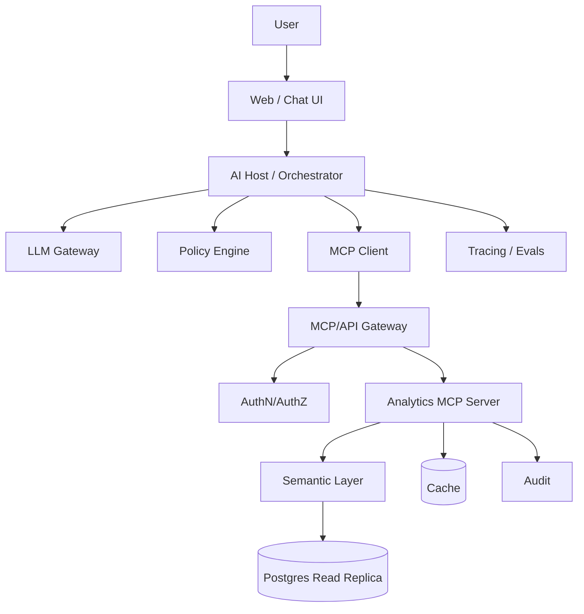

# MCP на продуктовом и system design интервью
## Как отвечать сильно, структурно и по-бизнесовому

---

# 1. Что проверяет интервьюер

Недостаточно сказать:

```text
MCP — USB-C для AI.
```

Проверяют понимание:

- бизнес-задачи;
- границ системы;
- host/client/server;
- contracts;
- security;
- reliability;
- scaling;
- cost;
- trade-offs;
- rollout;
- metrics.

---

# 2. Сильный ответ «Что такое MCP?»

> Model Context Protocol — открытый протокол, стандартизирующий подключение AI-приложений к внешним данным, инструментам и workflow. В архитектуре есть host, управляющий AI-приложением и пользовательскими разрешениями, MCP clients внутри host и MCP servers, предоставляющие tools, resources и prompts. Стороны используют JSON-RPC 2.0, проходят initialization и согласуют capabilities. MCP не заменяет существующие API: server часто является безопасным AI-friendly адаптером над базой или доменным сервисом.

Почему ответ сильный:

- определение;
- роли;
- protocol;
- features;
- отличие от API;
- security framing.

---

# 3. MCP против function calling

> Function calling — механизм, с помощью которого модель выбирает функцию и формирует аргументы. MCP решает более широкий интеграционный вопрос: как host обнаруживает возможности server, устанавливает соединение, согласует protocol version и capabilities, вызывает tools, получает resources и использует prompts. Host может преобразовать MCP tools в формат tool calling конкретной LLM, но это разные уровни.

---

# 4. MCP против OpenAPI

> OpenAPI описывает HTTP endpoints, request и response schemas. MCP — протокол AI-host/client/server с lifecycle, capability negotiation и сущностями tools, resources и prompts. MCP server может вызывать API, описанный OpenAPI, но одно не равно другому.

---

# 5. Framework для продуктового вопроса

Вопрос:

```text
Спроектируйте AI-аналитика для retail.
```

## 5.1. Пользователь

Выбрать одного:

- demand planner;
- category manager;
- store manager;
- executive.

Не пытаться в MVP обслужить всех.

## 5.2. JTBD

```text
Planner хочет быстро понять причину большого отклонения
forecast от actual и решить, нужна ли correction.
```

## 5.3. Current workflow

- forecast report;
- sales;
- OOS;
- promo;
- delivery;
- ручной RCA.

## 5.4. Pain

- 30–60 минут;
- много систем;
- ошибки;
- знания у отдельных сотрудников.

## 5.5. MVP

Read-only assistant:

- получает данные;
- рассчитывает metrics;
- объясняет причины;
- показывает evidence.

Не начинать с auto-update forecast.

## 5.6. Metrics

- time-to-insight;
- accepted RCA;
- adoption;
- WAPE/OOS;
- hallucination rate;
- tool failure rate.

---

# 6. System design кейс
## AI-аналитик над Supabase/Postgres через MCP

---

# 7. Уточняющие вопросы

## Users

- Сколько пользователей?
- Internal или external?
- Multi-tenant?
- Какие roles?

## Data

- Какие tables?
- Есть PII?
- Размер?
- Freshness?
- Read или write?

## Load

- QPS?
- Peak load?
- Latency SLA?
- Result size?

## Security

- Login method?
- RLS?
- Data residency?
- Audit/compliance?

## Product

- Свободный SQL или domain tools?
- Нужны charts/export?
- Scheduled reports?
- Critical actions?

---

# 8. Требования

## Functional

1. User задаёт вопрос.
2. Система видит доступные metrics/dimensions.
3. LLM выбирает безопасный tool.
4. Server выполняет query.
5. Ответ содержит result, filters и freshness.
6. LLM объясняет.
7. Каждый вызов аудируется.

## Non-functional

- p95 < 5 seconds для стандартного отчёта;
- 99.9% availability;
- tenant isolation;
- read-only MVP;
- max rows;
- statement timeout;
- complete audit;
- graceful degradation.

---

# 9. High-level design



---

# 10. Почему semantic layer

Свободный SQL создаёт проблемы:

- неправильные joins;
- разные определения revenue;
- PII;
- дорогие queries;
- unstable schemas.

Semantic layer определяет:

- metrics;
- dimensions;
- joins;
- filters;
- permissions;
- business definitions.

Tools:

```text
list_metrics()
get_metric(metric, dimensions, filters, date_range, limit)
compare_periods(...)
get_anomaly_explanation(...)
```

---

# 11. Tool contract

Пример `get_metric`.

Input:

- metric enum;
- dimensions array;
- structured filters;
- date_from/date_to;
- timezone;
- limit.

Validation:

- metric доступна role;
- dimensions совместимы;
- period ограничен;
- filters allowlisted;
- limit ограничен.

Output:

- columns;
- rows;
- units;
- freshness;
- applied filters;
- warnings;
- query ID.

---

# 12. Authentication и authorization

1. User входит в host.
2. Host получает identity.
3. MCP client использует scoped token.
4. Server валидирует token.
5. Trusted tenant/user context передаётся в semantic layer.
6. DB применяет RLS или обязательные predicates.
7. Audit связывает call с user.

`tenant_id` из аргумента модели нельзя считать источником истины.

---

# 13. Масштабирование

Server желательно делать stateless, где возможно.

- load balancer;
- replicas;
- connection pool;
- async I/O;
- shared cache;
- read replicas;
- queue для долгих jobs;
- object storage для exports.

Если sessions stateful:

- shared session store;
- secure IDs;
- TTL;
- sticky routing или shared state.

---

# 14. Долгие задачи

Паттерн:

```text
start_report → task_id
get_task_status(task_id)
get_task_result(task_id)
cancel_task(task_id)
```

Нужны:

- ownership binding;
- expiry;
- progress;
- cancellation;
- rate limit;
- secure task IDs.

---

# 15. Caching

Cache key учитывает:

- tenant;
- role/scope;
- metric;
- filters;
- period;
- data version.

Ошибка:

```text
cache key = только query text
```

Это создаёт cross-tenant leakage.

Нужно определить TTL, invalidation, freshness display и защиту от cache stampede.

---

# 16. Failure modes

## DB недоступна

- понятная ошибка;
- не выдумывать result;
- circuit breaker;
- alert.

## Неверный tool

- хорошие descriptions;
- eval set;
- routing;
- ограниченный tool set.

## Слишком большой result

- aggregation;
- pagination;
- max bytes;
- export/resource.

## Stale data

- timestamp;
- freshness SLA;
- warning.

## Partial failure

- вернуть доступную часть;
- явно отметить missing dependencies.

---

# 17. Главный trade-off: SQL против domain tools

## Arbitrary SQL

Плюс: гибкость.

Минусы:

- security;
- cost;
- unstable behavior;
- governance;
- PII.

## Domain tools

Плюсы:

- безопаснее;
- понятнее;
- тестируемо;
- стабильная semantics.

Минусы:

- больше разработки;
- медленнее покрывать long tail.

Сильный выбор:

```text
domain tools + semantic layer,
а sandboxed SQL — только ограниченным аналитикам.
```

---

# 18. Rollout

## Phase 0 — offline evaluation

Реальные вопросы и эталоны.

## Phase 1 — dogfood

Небольшая внутренняя группа.

## Phase 2 — read-only pilot

Без mutations.

## Phase 3 — recommendations

Agent предлагает действие.

## Phase 4 — approved writes

Только после confirmation.

## Phase 5 — limited automation

Низкий риск, budget, rollback и monitoring.

---

# 19. Метрики

## Infrastructure

- availability;
- p95/p99 latency;
- error rate;
- saturation.

## MCP

- initialization failure;
- tool discovery latency;
- call success;
- schema validation error;
- session error.

## LLM

- correct tool selection;
- argument accuracy;
- groundedness;
- token/cost.

## Product

- completion rate;
- time saved;
- adoption;
- business KPI.

## Safety

- unauthorized call;
- confirmation bypass;
- leakage;
- policy denial;
- audit completeness.

---

# 20. Частые вопросы интервьюера

## Почему не дать модели прямой доступ к базе?

> LLM output недоверенный и вероятностный. Прямой доступ создаёт риск PII leakage, тяжёлых запросов, неверных joins и mutations. Я использую read-only role, approved views/semantic layer, limits, audit и domain tools. Свободный SQL — только в sandbox для ограниченной роли.

## Как бороться с prompt injection?

> Не полагаться только на system prompt. Нужны allowlist tools, least privilege, read/write separation, human confirmation, egress policy, маркировка внешнего контента и server-side authorization.

## Что если server добавил новый tool?

> Dynamic discovery не означает automatic permission. Новый tool классифицируется по риску, проходит review и policy approval.

## Как защитить write?

> Явное summary действия, authorization в момент execution, idempotency, confirmation, audit, limits и rollback/compensation.

## Как измерить качество?

> End-to-end evals: tool selection, argument accuracy, execution success, grounding, policy compliance, latency, cost и business outcome.

---

# 21. Красные флаги

- «MCP полностью решает безопасность».
- «Дадим GPT root-доступ».
- «Один tool execute_anything».
- «Модель проверит permissions».
- «Retry любого write безопасен».
- «Read-only безопасен автоматически».
- «Registry package не требует review».
- «Измеряем только число запросов».
- «Сразу автоматизируем production mutations».

---

# 22. Сильная финальная формулировка

> Я проектирую MCP не как тонкую прокладку, отдающую модели весь backend, а как контролируемый доменный интерфейс. Host отвечает за UX, LLM orchestration и consent; MCP client — за протокол; MCP server — за contract, validation и адаптацию к domain services. Права проверяются детерминированно, критичные действия подтверждаются человеком, а система измеряется по end-to-end бизнес-успеху, безопасности, latency и стоимости.

---

# 23. Шаблон ответа на любую MCP system design задачу

```text
1. Пользователь и JTBD.
2. Functional requirements.
3. NFR.
4. Data classification.
5. Read/write risk.
6. Host-client-server architecture.
7. Tools/resources/prompts.
8. Schemas.
9. Authentication/authorization.
10. Storage/backend.
11. Reliability.
12. Security.
13. Observability.
14. Evaluation.
15. Rollout.
16. Trade-offs.
```
